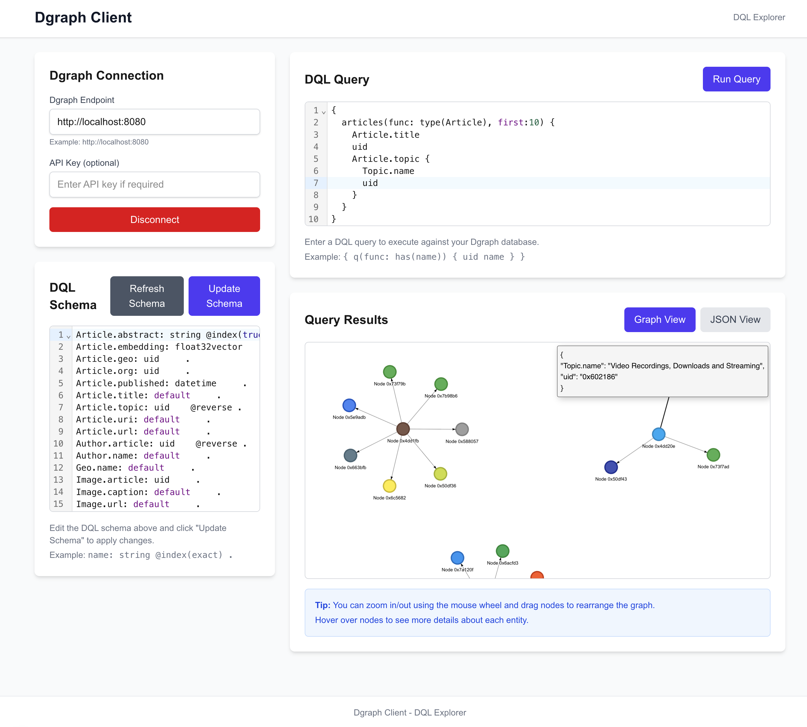

# Dgraph Client Application

A modern, responsive web-based client for interacting with Dgraph databases using DQL (Dgraph Query Language). This application provides an intuitive, mobile-first interface for database administrators and developers to work with Dgraph databases without needing to use command-line tools or write code.



## ✨ Features

- **🎯 Modern UI/UX**
  - **Professional Design System**: Modern browser-based development tool interface
  - **Chakra UI v3**: Beautiful, accessible components with semantic design tokens
  - **Lucide Icons**: Consistent, scalable icon system throughout the application
  - **Responsive Design**: Mobile-first design that works perfectly on all devices
  - **Dark/Light Themes**: Automatic theme switching with system preference detection
  - **Enhanced Accessibility**: WCAG compliant components with full keyboard navigation
  - **Smooth Animations**: Micro-interactions and transitions for better UX

- **🔌 Connection Management**
  - Connect to any Dgraph instance with endpoint URL configuration
  - Optional API key support for secured Dgraph instances
  - Visual connection status indicators with real-time updates
  - Secure credential handling and connection state management

- **📊 Schema Management & Visualization**
  - View the current DQL schema with syntax highlighting
  - Edit and update the schema with real-time feedback
  - Support for all Dgraph schema types and directives
  - **Advanced Schema Visualization**: Interactive graph representation of your database structure
  - **Smart Data Analysis**: Automatically discovers types, predicates, and relationships from live data
  - **Real-time Insights**: Shows instance counts and relationship mappings
  - **Click-to-Inspect**: Interactive nodes and edges with detailed property panels

- **💻 DQL Query Interface**
  - Execute DQL queries against your Dgraph instance
  - **CodeMirror Integration**: Advanced syntax highlighting and autocomplete
  - **Query Variables**: Support for parameterized queries
  - **Error Handling**: Descriptive error messages with context
  - **Fullscreen Mode**: Distraction-free query editing

- **🎨 Results Visualization**
  - **Multiple Visualization Engines**: Sigma.js, react-graph-vis, and Leaflet.js
  - **Interactive Graph Visualization**: Node and edge manipulation with physics simulation
  - **Geographic Data Support**: Map-based visualization for location data
  - **Responsive Views**: Toggle between graph, JSON, and map views
  - **Advanced Controls**: Zoom, pan, node positioning, and simulation settings

- **📚 Query History & Learning**
  - Persistent storage of executed queries using browser localStorage
  - **Interactive Guides**: Step-by-step DQL tutorials with examples
  - **Query Templates**: Pre-built queries for common operations
  - **Learning Path**: Progressive difficulty levels for DQL mastery

- **🧠 Intelligent Autocomplete**
  - **Schema-Aware Suggestions**: Based on your current Dgraph schema
  - **Context-Sensitive Completions**: DQL queries and schema editing
  - **Real-Time Updates**: Suggestions update as you modify schemas
  - **Function & Directive Support**: Complete DQL language coverage

- **🔍 Vector Search & AI Integration**
  - **Multi-Provider Support**: OpenAI, Anthropic, and Ollama embeddings
  - **Semantic Search**: Natural language queries converted to vector embeddings
  - **Local AI Support**: Run embeddings locally with Ollama integration
  - **Auto-Query Generation**: Automatically generates DQL vector search queries
  - **Variable Integration**: Embeddings passed as query variables to Dgraph

- **🤖 Text to DQL (AI-Powered Query Generation)**
  - **Natural Language Interface**: Convert plain English to DQL queries
  - **MCP Integration**: Uses Model Context Protocol for enhanced query generation
  - **Schema-Aware**: Leverages your database schema for accurate queries
  - **Dual Mode**: MCP server support with AI fallback
  - **One-Click Execution**: Generated queries can be run immediately

## 🏗️ Project Architecture

The application follows a modern, scalable React architecture using Next.js 15 with the App Router, built with TypeScript and Chakra UI v3. The architecture emphasizes:

- **Component-Based Design**: Modular, reusable components with clear separation of concerns
- **Type Safety**: Full TypeScript coverage for better development experience
- **Responsive Design**: Mobile-first approach with progressive enhancement
- **Performance**: Optimized rendering with Next.js App Router and Turbopack
- **Accessibility**: WCAG compliant components and keyboard navigation

### 🏛️ Architecture Overview

```
┌─────────────────────────────────────────────────────────────┐
│                    Application Shell                        │
├─────────────────────────────────────────────────────────────┤
│  Toolbar │ Sidebar │ ContentPanel                         │
│  (Header)│ (Nav)   │ (Dynamic Content)                    │
└─────────────────────────────────────────────────────────────┘
                              │
                              ▼
┌─────────────────────────────────────────────────────────────┐
│                   Feature Components                        │
├─────────────────────────────────────────────────────────────┤
│ Connection │ Schema │ Guides │ Query                      │
│ Management │ Editor │ System │ Editor                     │
└─────────────────────────────────────────────────────────────┘
                              │
                              ▼
┌─────────────────────────────────────────────────────────────┐
│                    Data Layer                              │
├─────────────────────────────────────────────────────────────┤
│ DgraphContext │ DgraphService │ Local Storage             │
│ (State Mgmt)  │ (API Client)  │ (Query History)          │
└─────────────────────────────────────────────────────────────┘
```

### 🗂️ Project Structure

```
dgraph-client-app/
├── src/
│   ├── app/                    # Next.js App Router pages
│   │   ├── api/               # API routes for guides and data
│   │   ├── globals.css        # Global styles and Chakra UI overrides
│   │   ├── layout.tsx         # Root layout with Chakra UI providers
│   │   └── page.tsx           # Main application page
│   ├── components/            # React components
│   │   ├── ui/                # Base UI components and theme
│   │   │   ├── provider.tsx   # Chakra UI provider setup
│   │   │   ├── theme.ts       # Custom theme with semantic tokens
│   │   │   └── color-mode.tsx # Theme switching logic
│   │   ├── __tests__/         # Component tests
│   │   ├── mdx/               # MDX rendering components
│   │   └── *.tsx              # Feature components
│   ├── context/               # React Context providers
│   │   └── DgraphContext.tsx  # Global Dgraph state management
│   ├── services/              # Business logic and API services
│   │   ├── dgraphService.ts   # Dgraph API communication
│   │   └── embeddingService.ts # AI embedding generation service
│   ├── types/                 # TypeScript type definitions
│   ├── utils/                 # Utility functions and helpers
│   │   ├── vectorSearchBuilder.ts # Vector search query generation
│   │   └── *.ts              # Other utility functions
│   └── styles/                # Component-specific styles
├── public/                    # Static assets and images
├── jest.config.js            # Jest testing configuration
├── next.config.ts            # Next.js configuration
├── tsconfig.json             # TypeScript configuration
└── package.json              # Dependencies and scripts
```

### 🔑 Key Design Patterns

1. **Context-Based State Management**
   - Uses React Context API for global state (no external libraries)
   - Provides Dgraph connection state throughout the application
   - Manages theme switching and user preferences

2. **Service Layer Pattern**
   - Isolates API communication in a dedicated service layer
   - Abstracts Dgraph-specific operations and error handling
   - Provides clean interfaces for data operations

3. **Component Composition**
   - Modular components with single responsibilities
   - Reusable UI elements with consistent styling
   - Responsive design patterns throughout

4. **Modern Design System**
   - Professional development tool interface with semantic design tokens
   - Lucide React icon system for consistent visual language
   - Enhanced accessibility with focus management and keyboard navigation
   - Micro-interactions and smooth animations for better UX

## 🎨 Modern Design & User Experience

### Development Tool Interface
The application follows modern browser-based development tool design patterns, drawing inspiration from VS Code, GitHub, and other professional developer tools:

#### Visual Design
- **Clean Layout**: Minimalist design focused on content and functionality
- **Consistent Spacing**: Systematic spacing scale using Chakra UI design tokens
- **Professional Typography**: Hierarchy with proper font weights and sizes
- **Subtle Shadows**: Layered elevation system for visual depth
- **Border Radius**: Consistent rounded corners (lg: 12px for cards, md: 8px for buttons)

#### Interactive Elements
- **Hover Effects**: Subtle color changes and elevation on interactive elements
- **Focus States**: Clear, accessible focus indicators for keyboard users
- **Loading States**: Professional loading indicators and disabled states
- **Micro-animations**: Smooth transitions (0.15s ease-in-out) for better perceived performance

#### Icon System
- **Lucide React**: Professional icon library with 1000+ consistent icons
- **Semantic Usage**: Icons that clearly communicate function and state
- **Consistent Sizing**: 16px default with larger sizes (18-20px) for important actions
- **Accessibility**: All icons include proper ARIA labels and tooltips

#### Status & Feedback
- **Connection Status**: Real-time visual indicators with color-coded states
- **Error Handling**: Clear, actionable error messages with appropriate styling
- **Success States**: Positive feedback for completed actions
- **Loading States**: Professional spinners and skeleton states

### Keyboard Navigation
The application supports comprehensive keyboard navigation for power users:
- **Cmd/Ctrl + B**: Toggle sidebar visibility
- **Cmd/Ctrl + 1**: Navigate to Connection section
- **Cmd/Ctrl + 2**: Navigate to Schema section  
- **Cmd/Ctrl + 3**: Navigate to Guides section
- **Cmd/Ctrl + 4**: Navigate to Query section
- **Cmd/Ctrl + 5**: Navigate to Text to DQL section
- **Tab Navigation**: Logical tab order through all interactive elements
- **Focus Trapping**: Proper focus management in modals and panels

## 🛠️ Technology Stack

### Core Framework
- **Next.js 15** - React framework with App Router and Turbopack
- **React 19** - Latest React with concurrent features
- **TypeScript 5** - Static type checking and modern JavaScript features

### UI and Styling
- **Chakra UI v3** - Modern component library with semantic design tokens
- **Lucide React** - Professional icon system with 1000+ consistent icons
- **Emotion** - CSS-in-JS styling solution
- **Custom Theme System** - Semantic color tokens and layer styles
- **Responsive Design** - Mobile-first approach with breakpoint system

### Package Management
- **pnpm** - Fast, disk space efficient package manager
- **Turbopack** - Next.js built-in bundler for fast development

### Dgraph Communication
- **dgraph-js-http** - Official Dgraph client for JavaScript
- **axios** - Promise-based HTTP client with interceptors

### Code Editing
- **CodeMirror 6** - Modern text editor with DQL syntax support
- **@uiw/react-codemirror** - React wrapper for CodeMirror
- **Language Support** - DQL, JSON, and SQL syntax highlighting

### Data Visualization
- **Sigma.js** - Modern graph visualization library
- **react-sigma** - React wrapper for Sigma.js
- **Leaflet.js** - Interactive maps for geographic data
- **react-leaflet** - React wrapper for Leaflet.js

### AI & Vector Search
- **Vercel AI SDK** - Unified interface for multiple AI providers
- **@ai-sdk/openai** - OpenAI integration for embeddings
- **@ai-sdk/anthropic** - Anthropic integration for embeddings
- **Ollama Support** - Local AI model inference for privacy-first deployments

### Testing and Quality
- **Jest** - Test runner with React Testing Library
- **ESLint** - Code quality and consistency
- **TypeScript** - Compile-time error checking

## 📱 Responsive Design

The application is built with a **mobile-first approach** and provides an excellent experience across all device sizes:

### Breakpoint System
- **Mobile**: 0px - 768px (full-width sidebar overlay)
- **Tablet**: 768px - 992px (medium sidebar width)
- **Desktop**: 992px+ (standard sidebar width)

### Responsive Features
- **Adaptive Layout**: Content adjusts based on screen size with consistent spacing
- **Touch-Friendly**: Optimized for mobile and tablet interaction with larger touch targets
- **Smart Sidebar**: Collapsible with icon-only mode (72px width) for efficient space usage
- **Smooth Transitions**: 300ms cubic-bezier animations for sidebar and content adjustments
- **Fixed Toolbar**: 60px height toolbar that stays accessible across all screen sizes
- **Flexible Content**: Main content expands dynamically to use available space
- **Mobile Overlay**: Intuitive dark backdrop when sidebar is open on mobile
- **Progressive Enhancement**: Enhanced features and labels appear on larger screens

## 🎨 Theme System

### Professional Design System
The application features a comprehensive design system inspired by modern development tools like VS Code and GitHub:

#### Semantic Design Tokens
```typescript
// Sophisticated color palette
'bg.primary': { _light: '#fafafa', _dark: '#0a0a0a' }
'bg.secondary': { _light: '#ffffff', _dark: '#111111' }
'fg.primary': { _light: '#18181b', _dark: '#fafafa' }
'accent.primary': { _light: '#2563eb', _dark: '#3b82f6' }
'status.success': { _light: '#059669', _dark: '#10b981' }
```

#### Layer Styles & Components
- **Navigation Items**: Interactive hover states with smooth micro-animations and subtle transforms
- **Status Badges**: Professional indicators with icon and label combinations
- **Code Editors**: Enhanced focus states with custom border highlighting and shadows
- **Cards & Panels**: Elevated designs with consistent border radius (lg) and hover effects
- **Buttons**: Multiple variants (primary, secondary, ghost, toolbar) with proper states
- **Input Fields**: Large touch-friendly inputs with focus indicators

#### Accessibility Features
- **Focus Management**: Visible focus rings and logical tab order
- **Keyboard Navigation**: Cmd/Ctrl+B (sidebar), Cmd/Ctrl+1-4 (sections)
- **Screen Reader Support**: Proper ARIA labels and semantic markup
- **Color Contrast**: WCAG AA compliant color combinations

### Theme Switching
- **Automatic Detection**: Follows system preference by default
- **Manual Override**: Users can manually switch between light/dark
- **Persistent**: Theme choice is saved across sessions
- **Smooth Transitions**: Animated theme switching with CSS transitions

## 🔍 Vector Search & AI Integration

The application includes powerful vector search capabilities that enable semantic search using AI embeddings. This feature allows you to search your Dgraph data using natural language queries instead of exact matches.

### 🎯 How Vector Search Works

Vector search converts text into numerical representations (embeddings) that capture semantic meaning. Similar concepts have similar embeddings, enabling "fuzzy" or semantic matching beyond exact text matches.

**Traditional Search vs Vector Search:**
```dql
# Traditional exact match
{ q(func: regexp(description, /database/i)) { uid name description } }

# Vector search for similar meaning
{ vectorSearch(by: description_embedding, vector: $queryVector, topk: 10) { uid name description } }
```

### 🔧 Provider Configuration

Configure your preferred embedding provider in the **Connection Settings** under "Vector Search Configuration":

#### OpenAI Setup
1. Select "OpenAI" as provider
2. Enter your OpenAI API key
3. Optionally specify model (defaults to `text-embedding-ada-002`)

#### Anthropic Setup  
1. Select "Anthropic" as provider
2. Enter your Anthropic API key
3. Optionally specify model (defaults to `claude-3-haiku-20240307`)

#### Ollama Setup (Local)
1. Install and run Ollama locally: `ollama serve`
2. Pull an embedding model: `ollama pull nomic-embed-text`
3. Select "Ollama (Local)" as provider
4. Configure endpoint (defaults to `http://localhost:11434`)
5. Optionally specify model (defaults to `nomic-embed-text`)

### 🚀 Using Vector Search

#### Method 1: Vector Search Panel
1. **Open Vector Search**: Click "Vector Search" button in Query Editor
2. **Enter Search Text**: Type natural language description of what you're looking for
3. **Configure Field**: Specify which field contains your vector embeddings
4. **Generate Query**: Click "Generate Vector Search Query" to create DQL with embeddings
5. **Execute**: Run the generated query to get semantic search results

#### Method 2: Manual DQL with Variables
Write DQL queries using the `$queryVector` variable:
```dql
query vectorSearch($queryVector: [float], $topK: int, $alpha: float) {
  vectorSearch(by: description_embedding, vector: $queryVector, topk: $topK, alpha: $alpha) {
    uid
    dgraph.type
    name
    description
    description_embedding
  }
}
```

### 📋 Vector Search Examples

#### Example 1: Product Search
```typescript
// Search text: "comfortable running shoes"
// Generated query:
query vectorSearch($queryVector: [float], $topK: int, $alpha: float) {
  vectorSearch(by: product_description_embedding, vector: $queryVector, topk: 10, alpha: 1.0) {
    uid
    dgraph.type
    product_name
    product_description
    price
    category
  }
}
```

#### Example 2: Content Recommendation
```typescript
// Search text: "machine learning tutorials for beginners"
// Generated query:
query vectorSearch($queryVector: [float], $topK: int, $alpha: float) {
  vectorSearch(by: content_embedding, vector: $queryVector, topk: 5, alpha: 1.0) {
    uid
    dgraph.type
    title
    content
    author {
      name
    }
    tags {
      name
    }
  }
}
```

#### Example 3: Customer Support
```typescript
// Search text: "order cancellation refund policy"
// Generated query:
query vectorSearch($queryVector: [float], $topK: int, $alpha: float) {
  vectorSearch(by: faq_embedding, vector: $queryVector, topk: 3, alpha: 1.0) {
    uid
    dgraph.type
    question
    answer
    category
    helpful_count
  }
}
```

### 🗄️ Preparing Your Data for Vector Search

#### Step 1: Schema Design
Define predicates to store vector embeddings:
```dql
type Product {
  name: string @index(term) .
  description: string .
  description_embedding: [float] @index(hnsw(metric: "cosine", exponent: 4, m: 16, efConstruction: 100)) .
}
```

#### Step 2: Generate Embeddings
Create embeddings for your existing data (external script):
```typescript
import { openai } from '@ai-sdk/openai';
import { embedMany } from 'ai';

const products = [/* your product data */];
const embeddings = await embedMany({
  model: openai.embedding('text-embedding-ada-002'),
  values: products.map(p => p.description)
});

// Store embeddings in Dgraph
```

#### Step 3: Mutation with Embeddings
```dql
{
  set {
    _:product1 <name> "Running Shoes" .
    _:product1 <description> "Lightweight, comfortable running shoes perfect for daily training" .
    _:product1 <description_embedding> "[0.1, -0.2, 0.3, ...]"^^<[float]> .
    _:product1 <dgraph.type> "Product" .
  }
}
```

### 🔧 Advanced Vector Search Configuration

#### Vector Index Configuration
Dgraph supports HNSW (Hierarchical Navigable Small World) indexing for efficient vector search:

```dql
# Optimal index configuration for different use cases
description_embedding: [float] @index(hnsw(metric: "cosine", exponent: 4, m: 16, efConstruction: 100)) .

# Parameters:
# - metric: "cosine", "euclidean", or "dotproduct"
# - exponent: Controls precision (2-6, higher = more precise)
# - m: Max bidirectional links (8-48, higher = better recall)
# - efConstruction: Build-time search width (100-800, higher = better quality)
```

#### Query Optimization
- **topK**: Limit results (1-100, typically 5-20 for good performance)
- **alpha**: Similarity threshold (0.0-1.0, higher = more similar)
- **Field Selection**: Only query fields you need for better performance

### 🚨 Best Practices

#### Security
- **API Keys**: Store securely, never commit to version control
- **Environment Variables**: Use `.env.local` for sensitive data
- **Rate Limiting**: Be aware of provider API limits

#### Performance
- **Batch Operations**: Generate multiple embeddings together when possible
- **Caching**: Consider caching embeddings for frequently searched content
- **Index Tuning**: Adjust HNSW parameters based on your data size and accuracy needs

#### Data Quality
- **Consistent Text**: Normalize text before generating embeddings
- **Meaningful Content**: Ensure embedded text is descriptive and relevant
- **Regular Updates**: Regenerate embeddings when content changes significantly

### 🔍 Troubleshooting Vector Search

#### Common Issues
1. **No Results**: Check if your data has embeddings in the specified field
2. **API Errors**: Verify API keys and provider configuration
3. **Ollama Connection**: Ensure Ollama server is running and model is pulled
4. **Schema Issues**: Verify vector fields have proper HNSW indexing

#### Debug Queries
```dql
# Check if embeddings exist
{ q(func: has(description_embedding)) { uid count(description_embedding) } }

# Verify embedding format
{ q(func: has(description_embedding), first: 1) { 
  uid 
  description 
  description_embedding 
} }
```

## 🤖 Text to DQL: AI-Powered Query Generation

The Text to DQL feature allows you to generate DQL queries from natural language descriptions using AI. This powerful capability makes it easier for developers to interact with Dgraph databases without needing to memorize complex DQL syntax.

### 🎯 How It Works

The Text to DQL system operates in two modes:

1. **MCP Mode** (Enhanced): Uses a Model Context Protocol (MCP) server specifically designed for Dgraph
2. **Direct AI Mode** (Fallback): Uses the Vercel AI SDK to generate queries directly

The system automatically leverages your database schema to generate more accurate and relevant queries.

### 🔧 Setup and Configuration

#### Method 1: MCP Server Setup (Recommended)

1. **Install the Dgraph MCP Server**:
   ```bash
   npm install -g @modelcontextprotocol/server-dgraph
   ```

2. **Configure MCP in the Connection Tab**:
   - Navigate to the Connection section
   - Expand "MCP Configuration"
   - Enter your MCP config JSON:
   ```json
   {
     "endpoint": "localhost:9080",
     "apiKey": "your-dgraph-api-key",
     "serverUrl": "http://localhost:3001/mcp"
   }
   ```

3. **Start your MCP server** (typically runs alongside your application)

#### Method 2: Direct AI Mode (Always Available)

The system automatically falls back to direct AI generation using the Vercel AI SDK if MCP is not configured or unavailable. This uses Anthropic's Claude model to generate queries.

### 🚀 Using Text to DQL

1. **Navigate to Text to DQL tab** in the left sidebar
2. **Ensure database connection** - you must be connected to a Dgraph instance
3. **Enter your description** in plain English:
   ```
   Find all patients with diabetes who visited in the last month
   ```
4. **Generate query** - click "Generate DQL Query"
5. **Review the generated DQL**:
   ```dql
   {
     patients(func: eq(diagnosis, "diabetes")) @filter(ge(last_visit, "2024-07-01")) {
       uid
       dgraph.type
       name
       diagnosis
       last_visit
     }
   }
   ```
6. **Execute immediately** - click "Execute Query" to run the generated query

### 📋 Example Use Cases

#### Simple Data Retrieval
**Input**: "Show me all movies from 2023"
**Generated DQL**:
```dql
{
  movies(func: eq(release_year, "2023")) {
    uid
    dgraph.type
    title
    release_year
    genre
  }
}
```

#### Complex Relationships
**Input**: "Find directors who have made more than 3 action movies"
**Generated DQL**:
```dql
{
  directors(func: type(Director)) @filter(gt(count(directed), 3)) {
    uid
    dgraph.type
    name
    directed @filter(eq(genre, "Action")) {
      uid
      title
      genre
    }
  }
}
```

#### Aggregations and Filtering
**Input**: "What's the average rating of sci-fi movies released after 2020?"
**Generated DQL**:
```dql
{
  query(func: allofterms(genre, "sci-fi")) @filter(ge(release_year, "2020")) {
    avg_rating: avg(rating)
    count: count(uid)
  }
}
```

### 🎛️ Advanced Configuration

#### MCP Server Configuration Options
```json
{
  "endpoint": "your-dgraph-host:9080",
  "apiKey": "your-api-key",
  "serverUrl": "http://localhost:3001/mcp",
  "timeout": 30000,
  "maxRetries": 3
}
```

#### AI Model Configuration
The system uses Anthropic's Claude Haiku model by default for fast, cost-effective query generation. The model selection is optimized for:
- **Speed**: Quick response times for interactive use
- **Accuracy**: Schema-aware generation using your database structure
- **Cost-Effectiveness**: Efficient token usage for query generation

### 🛡️ Security Considerations

- **API Keys**: MCP configuration is stored locally in browser localStorage
- **Validation**: Generated queries are validated before execution
- **Sandboxing**: MCP server runs in isolated environment
- **Error Handling**: Safe fallback to direct AI mode if MCP fails

### 🔍 Troubleshooting Text to DQL

#### Common Issues

1. **"MCP Server not configured"**
   - Configure MCP in the Connection tab
   - Ensure your MCP server is running
   - Check the JSON configuration format

2. **"Failed to generate query"**
   - Check your database connection
   - Verify AI provider credentials (Anthropic API key)
   - Try simpler language in your description

3. **Generated query syntax errors**
   - The AI generates queries based on your schema
   - Ensure your schema is properly loaded
   - Try more specific descriptions with field names

#### Debug Tips

- **Check MCP Status**: The Text to DQL tab shows MCP connection status
- **Review Schema**: Ensure your database schema is loaded and visible
- **Start Simple**: Begin with basic queries and gradually increase complexity
- **Use Field Names**: Include specific predicate names in your descriptions for better results

### 🎯 Best Practices

1. **Be Specific**: Include field names and relationships in your descriptions
2. **Use Schema Terms**: Reference types and predicates from your actual schema
3. **Start Simple**: Begin with basic queries before moving to complex aggregations
4. **Review Generated Queries**: Always review AI-generated queries before execution
5. **Iterate**: Refine your natural language descriptions based on results

The Text to DQL feature represents a significant step toward making graph databases more accessible to developers of all skill levels, while maintaining the power and flexibility of DQL.

## 📊 Interactive Schema Visualization

The Schema Visualization feature provides a comprehensive, interactive view of your Dgraph database structure. Unlike traditional schema viewers that only show static type definitions, this advanced visualization analyzes your live data to create a dynamic, relationship-rich representation of your database.

### 🎯 Key Features

#### Smart Data Discovery
The visualization automatically analyzes your database to discover:
- **Type Nodes**: All types in your database with instance counts (e.g., "Patient (1,099)")
- **Predicate Relationships**: Actual connections between types based on your data
- **Property Details**: Complete predicate information for each type
- **Real-time Updates**: Live data analysis with refresh capability

#### Interactive Graph Visualization
- **Clickable Type Nodes**: Click any node to see all its predicates and properties
- **Relationship Edges**: Blue arrows showing connections between types with predicate labels
- **Property Panel**: Detailed view of predicates with type information, array flags, and references
- **Professional Design**: Clean, readable visualization with proper sizing and coloring

#### Advanced Analytics
- **Instance Counting**: See how many instances of each type exist in your database
- **Relationship Mapping**: Understand which types connect to which other types
- **Predicate Analysis**: View all predicates for a type with detailed metadata
- **Performance Optimized**: Efficient queries that don't impact database performance

### 🔧 How It Works

#### Data Analysis Query
The visualization uses a sophisticated DQL query to analyze your database structure:

```dql
{
  # Variable block to collect all typed nodes
  var(func: has(dgraph.type)) {
    all_typed_nodes as uid
  }
  
  # 1. GET ALL UNIQUE NODE TYPES WITH COUNTS
  node_type_counts(func: has(dgraph.type)) @groupby(dgraph.type) {
    count(uid)
  }
  
  # 2. COMPLETE SCHEMA DISCOVERY - No hardcoded predicates
  schema_discovery(func: uid(all_typed_nodes), first: 100) {
    node_type: dgraph.type
    node_uid: uid
    
    # Expand ALL predicates dynamically - captures everything
    expand(_all_) {
      # For any connected nodes, get their type to map relationships
      relationship_target_type: dgraph.type
    }
  }
}
```

#### Intelligent Processing
1. **Type Discovery**: Identifies all types in your database with instance counts
2. **Predicate Extraction**: Analyzes actual data to find all predicates for each type
3. **Relationship Mapping**: Detects connections between types through UID predicates
4. **Graph Construction**: Creates an interactive visualization with proper node and edge data

### 🚀 Using Schema Visualization

#### Getting Started
1. **Connect to Database**: Ensure you're connected to your Dgraph instance
2. **Navigate to Schema**: Click the "Schema" tab in the sidebar
3. **View Visualization**: The graph loads automatically with your database structure
4. **Refresh Data**: Click the "🔄 Refresh" button to update with latest data

#### Exploring Your Data
1. **Overview**: See all types as red nodes with instance counts
2. **Relationships**: Blue arrows show how types are connected
3. **Click Nodes**: Click any type node to see its predicates in the property panel
4. **Click Edges**: Click relationship arrows to see connection details
5. **Fullscreen Mode**: Use fullscreen for better visualization of large schemas

#### Understanding the Visualization

**Node Types:**
- **Red Circles**: Database types (e.g., Patient, Address, MedicalVisit)
- **Node Labels**: Type name with instance count (e.g., "Patient (1,099)")
- **Node Sizes**: Scaled based on instance count for visual hierarchy

**Edge Types:**
- **Blue Arrows**: Relationships between types
- **Edge Labels**: Predicate names or relationship counts
- **Directional**: Show the direction of relationships

**Property Panel:**
- **Type Details**: Shows selected type information
- **Predicate List**: All predicates with type, array, and UID information
- **Reference Types**: Which types are referenced by UID predicates

### 📋 Example: Medical Database

For a medical database, the visualization might show:

### 🎨 Visualization Features

#### Professional Height Management
- **Schema Visualization**: 600px container with 450px graph area for optimal schema exploration
- **Query Results**: 500px graph containers for clear, usable query result visualization
- **Guide Examples**: Consistent 500px height across all graph visualization modes
- **Responsive Design**: Adapts to different screen sizes while maintaining usability

#### Interactive Elements
- **Click-to-Inspect**: Click nodes to see detailed predicate information
- **Relationship Exploration**: Click edges to understand type connections
- **Property Panels**: Dedicated panels for node and edge details
- **Loading States**: Professional loading indicators during data processing

#### Visual Design
- **Color Coding**: Consistent color scheme across all visualizations
- **Node Sizing**: Dynamic sizing based on data importance
- **Edge Styling**: Clear relationship indicators with proper labeling
- **Layout Optimization**: Force-directed layouts for optimal node placement

#### Type Nodes
- **Patient (1,099)**: Large node representing patient records
- **MedicalVisit (764)**: Medium node for medical visits
- **Address (635)**: Medium node for location data
- **Organization (248)**: Smaller node for healthcare providers

#### Relationships
- **Patient → Address** (via `lives_in` predicate)
- **Patient → MedicalVisit** (via `has_visit` predicate)
- **MedicalVisit → Patient** (via `visit_of` predicate)
- **Patient → MedicalCondition** (via `has_condition` predicate)

#### Property Details (clicking Patient node)
```
Predicates (12):
- name: string [Array]
- age: int [Array]
- lives_in: uid [Array] → References: Address
- has_visit: uid [Array] → References: MedicalVisit
- has_condition: uid [Array] → References: MedicalCondition
- primary_language: string [Array]
- marital_status: string [Array]
- gender: string [Array]
- date_of_birth: string [Array]
- multiple_birth: bool [Array]
```

### 🎨 Visualization Features

#### Loading States
- **Professional Loading Indicators**: Spinner with progress messages
- **Smooth Transitions**: Loading → Complete visualization
- **Disabled Controls**: Prevents multiple refresh attempts during processing

#### Interactive Elements
- **Hover Effects**: Visual feedback on interactive elements
- **Click Handlers**: Separate handlers for nodes and edges
- **Property Panels**: Slide-in panels with detailed information
- **Close Controls**: Easy-to-access close buttons for panels

#### Visual Design
- **Professional Color Scheme**: Red nodes, blue edges, consistent styling
- **Readable Labels**: Clear typography with proper contrast
- **Responsive Layout**: Works on all screen sizes
- **Accessibility**: Keyboard navigation and screen reader support

### 🔍 Advanced Features

#### Relationship Analysis
- **Predicate Grouping**: Multiple predicates between same types are grouped
- **Relationship Counts**: Shows "3 relationships" for multi-predicate connections
- **Target Type Analysis**: Identifies all possible target types for predicates

#### Performance Optimizations
- **Efficient Queries**: Optimized for large databases
- **Smart Sampling**: Uses limited sample size (100 nodes) for analysis
- **Caching**: Processes data once and caches results
- **Background Processing**: Non-blocking analysis with loading states

#### Data Quality Insights
- **Instance Counts**: Understand data distribution across types
- **Relationship Density**: See which types are most connected
- **Schema Completeness**: Identify types with few or many predicates
- **Data Patterns**: Understand your database structure at a glance

### 🛠️ Technical Implementation

#### Modern Architecture
- **React + TypeScript**: Type-safe component architecture
- **Sigma.js Integration**: Professional graph visualization library
- **Graphology**: Efficient graph data structure management
- **Real-time Updates**: Live data synchronization with database

#### Height Management System
- **Fixed Height Containers**: Eliminates CSS height inheritance issues
- **Direct Height Assignment**: SigmaGraph components use explicit 500px heights
- **Container Hierarchy**: Proper height flow from parent to child components
- **Responsive Fallbacks**: Maintains usability across different viewport sizes

#### Graph Rendering Optimization
- **Container Validation**: Sigma.js containers have proper dimensions
- **Height Constraints**: Prevents "Container has no height" errors
- **Professional Sizing**: 500px height provides substantial visualization space
- **Consistent Layout**: All graph modes maintain uniform height allocation

#### Smart Query Design
- **Dynamic Discovery**: No hardcoded predicates or types
- **Efficient Sampling**: Uses `first: 100` for performance
- **Relationship Detection**: Automatic UID predicate identification
- **Error Handling**: Graceful fallbacks and error states

#### User Experience
- **Progressive Loading**: Data loads incrementally with feedback
- **Interactive Design**: Click-to-explore interface
- **Responsive**: Works on mobile, tablet, and desktop
- **Accessible**: WCAG compliant with keyboard navigation

### 🎯 Use Cases

#### Database Exploration
- **New Database**: Quickly understand structure of unfamiliar databases
- **Data Modeling**: Visualize relationships for schema design decisions
- **Documentation**: Generate visual documentation of database structure
- **Training**: Help team members understand data relationships

#### Development & Debugging
- **Schema Validation**: Verify relationships are properly modeled
- **Data Quality**: Identify types with unusual instance counts
- **Performance Analysis**: Understand query patterns and relationships
- **Migration Planning**: Visualize current state before schema changes

#### Business Intelligence
- **Stakeholder Communication**: Show database structure to non-technical users
- **Data Governance**: Understand data flow and relationships
- **Compliance**: Document data relationships for regulatory requirements
- **Analytics Planning**: Identify key entities and relationships for analysis

The Schema Visualization feature transforms the way you understand and work with your Dgraph database, providing immediate insights into your data structure and relationships through an intuitive, interactive interface.

## 🚀 Getting Started

### Prerequisites
- **Node.js**: Version 18.17 or higher
- **pnpm**: Version 8.0 or higher (recommended) or npm 9+
- **Git**: Latest version

### Quick Start

1. **Clone the repository**
   ```bash
   git clone https://github.com/your-username/dgraph-client-app.git
   cd dgraph-client-app
   ```

2. **Install dependencies**
   ```bash
   pnpm install
   ```

3. **Start development server**
   ```bash
   pnpm run dev
   ```

4. **Open your browser**
   Navigate to `http://localhost:3000` to see the application

### Environment Variables (Optional)

For default vector search configuration, create a `.env.local` file:

```bash
# OpenAI Configuration (optional - can also be set in UI)
NEXT_PUBLIC_DEFAULT_EMBEDDING_PROVIDER=openai
NEXT_PUBLIC_OPENAI_API_KEY=your_openai_api_key

# Anthropic Configuration (optional - can also be set in UI)
NEXT_PUBLIC_ANTHROPIC_API_KEY=your_anthropic_api_key

# Ollama Configuration (optional - can also be set in UI)
NEXT_PUBLIC_OLLAMA_ENDPOINT=http://localhost:11434
NEXT_PUBLIC_DEFAULT_EMBEDDING_MODEL=nomic-embed-text
```

**Note**: API keys can be configured either through environment variables or the connection settings UI. The UI settings take precedence and are stored securely in browser localStorage.

### Available Scripts

```bash
# Development
pnpm run dev          # Start development server with Turbopack
pnpm run build        # Build for production
pnpm run start        # Start production server

# Testing & Quality
pnpm run test         # Run Jest tests
pnpm run test:watch   # Run tests in watch mode
pnpm run test:coverage # Generate test coverage report
pnpm run lint         # Run ESLint
pnpm run type-check   # Run TypeScript type checking

# Maintenance
pnpm run clean        # Clean dependencies and build artifacts
pnpm run reinstall    # Clean and reinstall dependencies
```

## 🔌 Connecting to Dgraph

### Basic Connection
1. Start your Dgraph instance (locally or in the cloud)
2. In the application, enter your Dgraph endpoint (e.g., `http://localhost:8080`)
3. If your Dgraph instance requires authentication, enter your API key
4. Click "Connect" to establish the connection

### Connection Types Supported
- **HTTP/HTTPS**: Standard web protocols
- **DGraph Protocol**: Native DGraph protocol with SSL support
- **Hypermode**: Cloud-hosted DGraph instances
- **Local Development**: Localhost connections for development

### Security Features
- **SSL/TLS Support**: Secure connections with certificate verification
- **API Key Management**: Secure storage of authentication credentials
- **Connection Validation**: Automatic endpoint validation and testing

## 📊 Working with Data

### Schema Exploration
- **Interactive Schema Visualization**: Explore your database structure through an interactive graph
- **Live Data Analysis**: See actual type counts and relationships from your data
- **Click-to-Inspect**: Click nodes to see predicates, click edges to see relationships
- **Real-time Updates**: Refresh to see latest database structure

### Query Editor
- **Syntax Highlighting**: DQL syntax with CodeMirror integration
- **Autocomplete**: Schema-aware suggestions for predicates and functions
- **Query Variables**: Support for parameterized queries
- **Fullscreen Mode**: Distraction-free editing experience

### Visualization Options
- **Graph View**: Interactive node-edge visualization with Sigma.js and optimized 500px height containers
- **JSON View**: Structured data display with syntax highlighting
- **Map View**: Geographic data visualization with Leaflet.js
- **Schema View**: Database structure visualization with type relationships and 450px graph area

### Advanced Features
- **Physics Simulation**: Configurable force-directed layouts
- **Node Clustering**: Automatic grouping of similar nodes
- **Search & Filter**: Find specific nodes or relationships
- **Export Options**: Save visualizations as images or data

### 🎯 Height Management & Graph Rendering

#### Professional Visualization Heights
- **Query Results**: 500px height containers for clear, usable graph visualization
- **Schema Visualization**: 600px container with 450px dedicated graph area
- **Guide Examples**: Consistent 500px height across all interactive examples
- **Responsive Design**: Maintains usability across different screen sizes

#### Technical Improvements
- **Fixed Height Containers**: Eliminates CSS height inheritance issues
- **Sigma.js Optimization**: Prevents "Container has no height" errors
- **Direct Height Assignment**: Components use explicit height values
- **Container Validation**: Ensures proper dimensions for graph rendering

#### User Experience Enhancements
- **Substantial Graph Areas**: No more "few pixels high" visualization issues
- **Professional Layout**: Clean, balanced visualization containers
- **Consistent Sizing**: Uniform height across all graph modes
- **Better Interaction**: Larger graphs are easier to navigate and explore

## 🧪 Testing

### Test Coverage
The application includes comprehensive testing with:
- **Unit Tests**: Individual component testing
- **Integration Tests**: Component interaction testing
- **Visual Regression**: UI consistency testing
- **Accessibility Tests**: WCAG compliance verification

### Running Tests
```bash
# Run all tests
pnpm run test

# Run tests in watch mode
pnpm run test:watch

# Generate coverage report
pnpm run test:coverage

# Run specific test file
pnpm run test QueryEditor.test.tsx
```

## 📚 Interactive Learning Guides

The application features a comprehensive interactive guides system that provides hands-on learning experiences for DQL and graph database concepts.

### Available Guides

1. **Introduction to Dgraph Query Language** (`01-introduction.mdx`)
   - Basic DQL syntax and structure
   - Setting up schemas and sample data
   - Your first interactive queries

2. **Filtering Data in DQL** (`02-filtering.mdx`)
   - Predicate-based filtering
   - Regular expression patterns
   - Genre and type-based queries

3. **Graph Traversal in DQL** (`03-graph-traversal.mdx`)
   - Relationship traversal patterns
   - Multi-level graph exploration
   - Reverse edge navigation

4. **Mutations and Data Management** (`04-mutations-and-data-management.mdx`)
   - Schema definition and updates
   - Data insertion and updates
   - Relationship management

5. **E-commerce Dataset Guide** (`05-e-commerce-dataset.mdx`)
   - Complete e-commerce data model
   - Product catalogs and customer analytics
   - Order management queries

6. **Social Network Analysis** (`06-social-network-analysis.mdx`)
   - Social graph modeling
   - Influence and engagement analytics
   - Network growth analysis

7. **Geospatial Data and Location Queries** (`07-geospatial-data.mdx`)
   - Geographic data types
   - Location-based queries
   - Spatial analysis patterns

8. **Advanced Analytics and Aggregations** (`08-advanced-analytics.mdx`)
   - Complex aggregation functions
   - Time-based analytics
   - Business intelligence patterns

### Creating New Guides

To create a new interactive guide:

1. **Create the MDX file** in `src/mdx/guides/` with the naming pattern `XX-guide-name.mdx`:
   ```bash
   touch src/mdx/guides/09-my-new-guide.mdx
   ```

2. **Add frontmatter metadata** at the top of your file:
   ```yaml
   ---
   title: "Your Guide Title"
   description: "Brief description of what this guide covers"
   order: 9
   ---
   ```

3. **Write your guide content** using standard Markdown syntax with special interactive code blocks:

   ```markdown
   # Your Guide Title
   
   Introduction to your topic...
   
   ## Interactive Query Example
   
   ```dql-query
   {
     your_query(func: has(predicate)) {
       uid
       predicate
     }
   }
   ```
   
   ## Schema Updates
   
   ```dql-schema
   type YourType {
     field: string @index(term) .
   }
   ```
   
   ## Data Mutations
   
   ```dql-mutation
   {
     set {
       _:node <predicate> "value" .
       _:node <dgraph.type> "YourType" .
     }
   }
   ```
   ```

4. **Interactive Code Block Types**:
   - **`dql-query`**: Runnable DQL queries with "Run Query" button
   - **`dql-mutation`**: Executable mutations with "Run Mutation" button  
   - **`dql-schema`**: Schema definitions with "View Schema" and "Apply Schema" buttons
   - **Regular code blocks**: Standard syntax highlighting

5. **Guide Structure Best Practices**:
   - Start with schema definition when introducing new concepts
   - Provide sample data through mutations
   - Follow with progressive query examples
   - Include real-world use cases and scenarios
   - Use consistent naming conventions
   - Always include `uid` in queries for proper visualization

6. **Testing Your Guide**:
   - Restart the development server: `npm run dev`
   - Navigate to the Guides tab
   - Your new guide will appear in the selection interface
   - Test all interactive code blocks work correctly

### Guide Content Guidelines

- **Educational Flow**: Structure content from basic to advanced
- **Interactive Examples**: Include clickable code blocks for key concepts
- **Real Datasets**: Use relatable examples (movies, e-commerce, social networks)
- **Visualization Ready**: Ensure queries return data suitable for graph visualization
- **Error Handling**: Provide alternative queries if data might not exist
- **Cross-References**: Link concepts between different guides

### External Resources
- [Dgraph Documentation](https://dgraph.io/docs/) - Official Dgraph guides
- [DQL Reference](https://dgraph.io/docs/query-language/) - Complete DQL syntax
- [Schema Design](https://dgraph.io/docs/schema/) - Schema best practices
- [Performance Tuning](https://dgraph.io/docs/deploy/) - Optimization guides

## 🤝 Contributing

We welcome contributions! Please see our [CONTRIBUTING.md](CONTRIBUTING.md) file for detailed guidelines on:

- Setting up your development environment
- Understanding the project architecture
- Making code contributions
- Testing and quality standards
- Pull request process

### Quick Contribution Steps
1. Fork the repository
2. Create a feature branch
3. Make your changes
4. Add tests for new functionality
5. Submit a pull request

## 📄 License

This project is licensed under the MIT License - see the [LICENSE](LICENSE) file for details.

## 🙏 Acknowledgments

- **Dgraph Team** - For the excellent database and client libraries
- **Chakra UI Team** - For the beautiful component library
- **Next.js Team** - For the amazing React framework
- **Open Source Community** - For all the amazing tools and libraries

---

**Happy querying! 🚀**

For questions, issues, or contributions, please visit our [GitHub repository](https://github.com/your-username/dgraph-client-app).
